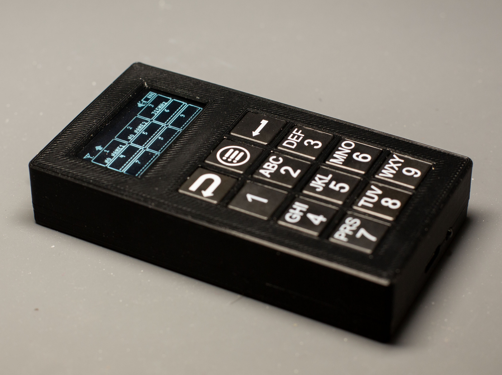
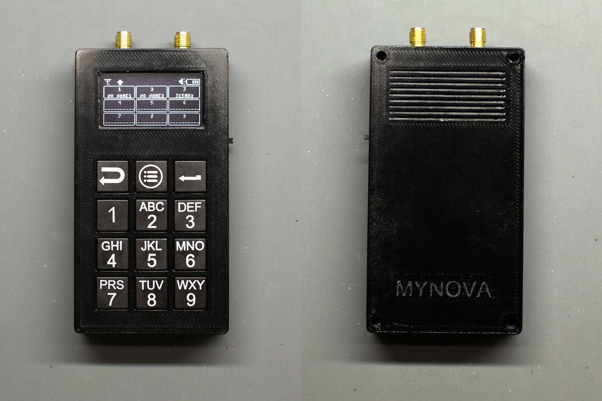
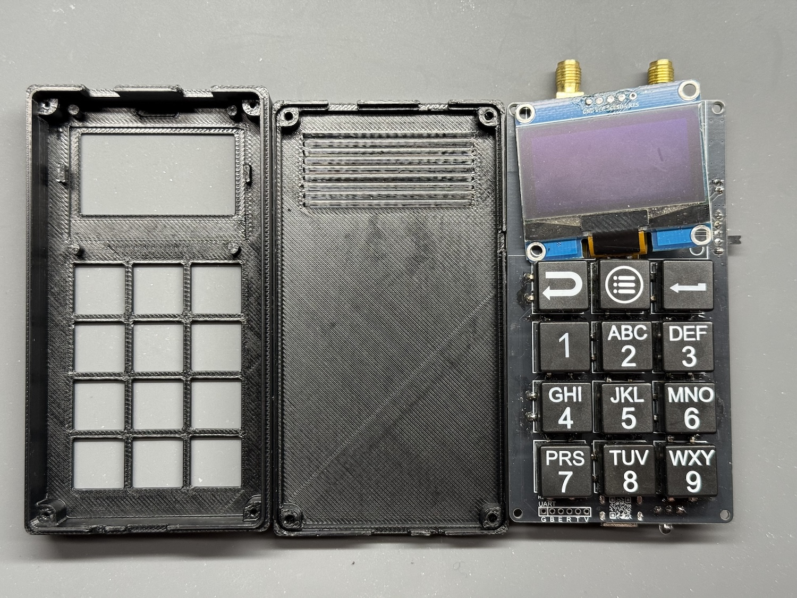
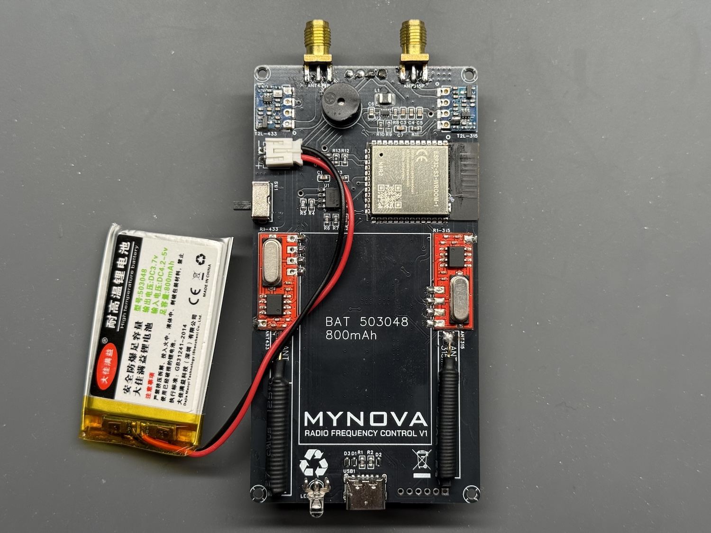
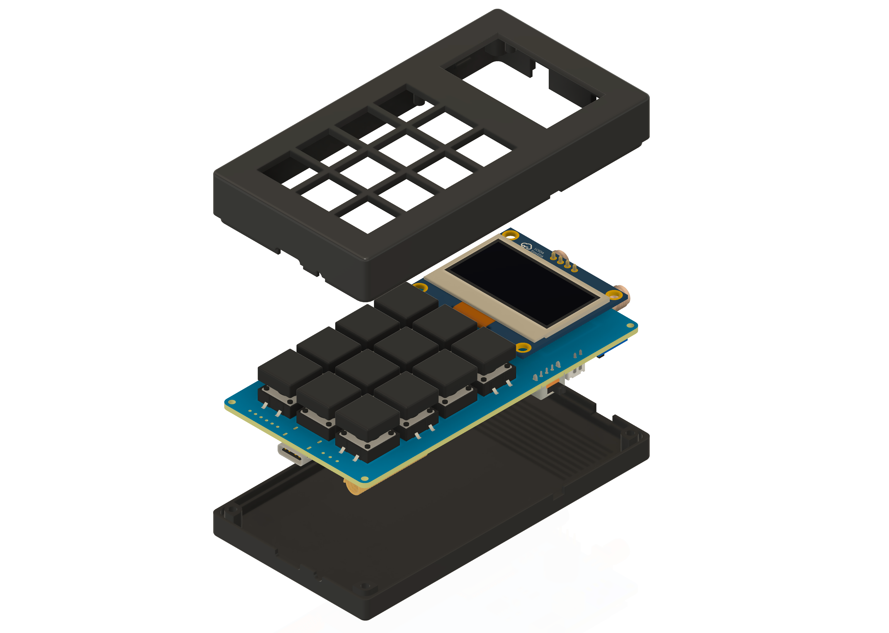
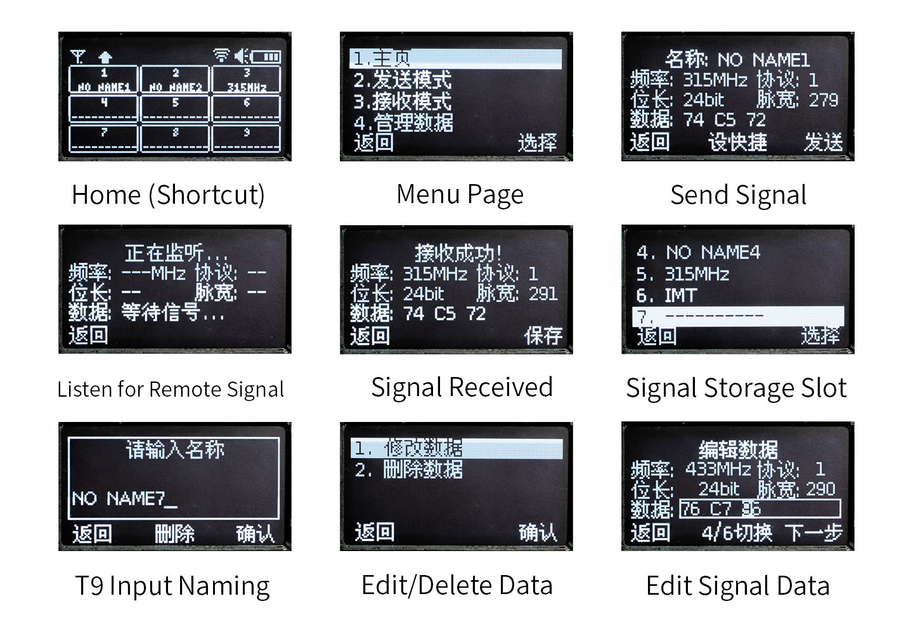
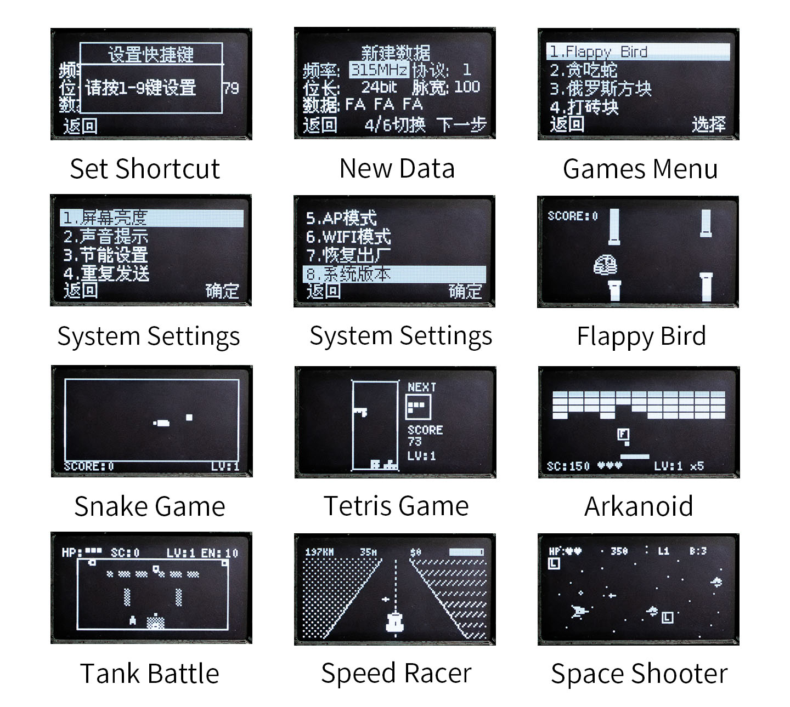
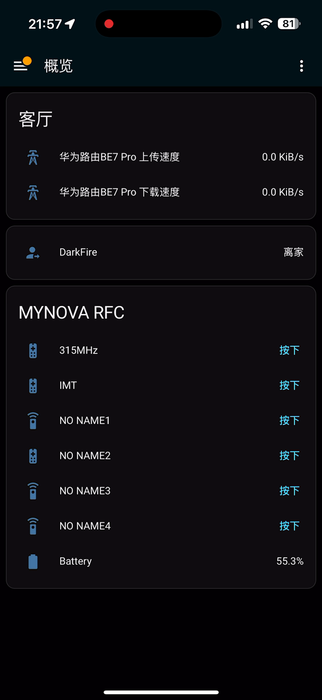

# MYNOVA RFC - Ultimate Radio Frequency Controller

[切换简体中文](README_CHS.md) | [English](README.md)

**MYNOVA RFC** (Radio Frequency Control) is an open-source handheld hardware project designed for analyzing, copying, and transmitting Radio Frequency (RF) signals. Powered by an ESP32 microcontroller, it combines a rich OLED user interface with powerful RF capabilities, web management, and Home Assistant integration.


## ✨ Features

### 📡 RF Capabilities
- **Signal Reception & Analysis:** Capture and analyze RF signals (315MHz/433MHz depending on module).
- **Signal Cloning:** Save captured signals to local storage.
- **Signal Transmission:** Replay saved signals to control devices.
- **Database:** Manage a library of RF codes directly on the device.

### 🎮 User Interface
- **OLED Display:** Smooth graphical interface powered by U8g2.
- **Interactive Menu:** Easy navigation with physical buttons.
- **Games:** Includes built-in games like Snake, Tetris, Arkanoid, Tank Battle, and more for entertainment.

### 🌐 Connectivity & IoT
- **WiFi Support:** Connect to your home network or run as an Access Point (AP).
- **Web Interface:** comprehensive web-based management dashboard.
  - Manage WiFi settings.
  - View and edit saved RF data.
  - Configure MQTT/Home Assistant settings.
- **Home Assistant Integration:** Seamlessly integrate with Home Assistant via MQTT to control your RF devices from your smart home hub.

### 🔋 Power Management
- **Battery Monitoring:** Real-time battery voltage and percentage display.
- **Power Saving:** Sleep modes and screen dimming.

## 🛠️ Hardware










## Enclosure Design


## 💻 Software & Firmware

### Development Environment
- **IDE:** [Arduino IDE 2.3.6](https://www.arduino.cc/en/software)
- **Board Package:** ESP32 by Espressif Systems **v3.1.1** (Strictly required).

### Dependencies
The firmware relies on the following Arduino libraries:
- **U8g2** (v2.34.22) - Graphics library for OLED.
- **ArrayList** (v1.0.0) - Dynamic array implementation.
- **ESP Async WebServer** (v3.9.2) - Asynchronous HTTP server.
- **AsyncTCP** (v3.4.9) - Asynchronous TCP library.
- **ArduinoJson** (v7.0.3) - JSON parsing and serialization.
- **PubSubClient** (v2.8) - MQTT client library.

### 📂 Directory Structure

```text
MYNOVA_RFC/
├── MYNOVA_RFC/             # Firmware Source Code
│   ├── src/
│   │   ├── GUI/            # Custom UI Engine
│   │   │   ├── Animation/  # Animation System (Transitions, Effects)
│   │   │   ├── Widget/     # UI Components (Button, Menu, ProgressBar)
│   │   │   ├── UIEngine    # Core UI Manager (Page Stack, Rendering)
│   │   │   └── UIPage      # Base Page Class
│   │   ├── Pages/          # Application Pages (Home, Games, Settings)
│   │   ├── Lib/            # Hardware Libraries (RCSwitch, etc.)
│   │   └── ...             # System Managers (WiFi, MQTT, Battery)
│   └── MYNOVA_RFC.ino      # Arduino Main Entry Point
├── RFCWeb/                 # Web Interface (Vue.js 3 + Vite)
├── 3DModel/                # 3DModels for shell
└── PCB/                    # PCB design file

```

## 🎨 Custom UI Engine Architecture

MYNOVA RFC features a powerful, self-developed GUI engine optimized for embedded ESP32 systems with OLED displays.

- **Page Management (Stack-based):** Implements a robust page stack system allowing seamless navigation (push/pop) similar to mobile apps.
- **Component-based Design (Widgets):** The UI is built using reusable `UIWidget` components (Buttons, Menus, ProgressBars), making it highly modular and easy to extend.
- **Deferred Deletion Mechanism:** Features a sophisticated memory management system (`markForDeletion`) that safely cleans up resources after the rendering frame completes, preventing runtime crashes common in C++ GUIs.
- **Animation System:** Supports smooth, non-blocking page transitions (Slide, Zoom) and element animations, decoupled from the rendering loop for maximum performance.

## Screen UI



## Web Control UI


## Home Assistant


## 🚀 Getting Started

### 1. Build and Upload Firmware (ESP32)
1.  Open `MYNOVA_RFC/MYNOVA_RFC.ino` in Arduino IDE.
2.  Install the required libraries listed above via the Library Manager.
3.  Select your board: **ESP32 Dev Module**.
4.  Ensure Core Debug Level is set appropriately if you need logs.
5.  Compile and upload to your device.

### 2. Build and Upload Web Interface (ESP32)
The web interface is pre-compiled and stored in the LittleFS of the ESP32. If you want to modify the web UI:

1.  Navigate to the `RFCWeb` directory.
2.  Install dependencies:
    ```bash
    npm install
    ```
3.  Run development server:
    ```bash
    npm run dev
    ```
4.  Build for production:
    ```bash
    npm run build
    ```
5.  Upload the contents of the `dist` folder to the ESP32's file system (LittleFS).
    * *Note: The upload address offset is `0x610000`, with a size of `0x1D0000`. This is defined in `partitions.csv`.*

**Note:** You can use my open-source tool, [ESP32-LittleFS-Flash](https://github.com/Tomosawa/ESP32-LittleFS-Flash), to easily upload the contents of the `dist` folder to the ESP32 file system (LittleFS).
The upload address offset is `0x610000` with a size of `0x1D0000`. This is defined in `partitions.csv`.

### 3. Firmware Flashing

1. **Download Firmware**: Download the latest `.bin` file from the [Release](https://github.com/tomosawa/MYNOVA-RFC/releases) page.
2. **Flashing Methods**:
   * **Flash Download Tool**: Select the `.bin` file and set the flash address to `0x0000`.
     * *Note: The firmware includes all partitions include Web UI; no additional configuration is required.*
   * **Command Line**:
     ```bash
     esptool.py --port /dev/ttyUSB0 write_flash 0x0000 MYNOVA_RFC-firmware.bin
     ```
     *Replace `/dev/ttyUSB0` with your ESP32's serial port.*

## 📄 License

This project is licensed under the **GNU General Public License v3.0**. See the [LICENSE](LICENSE) file for details.

## Acknowledgements
[rc-switch](https://github.com/sui77/rc-switch)