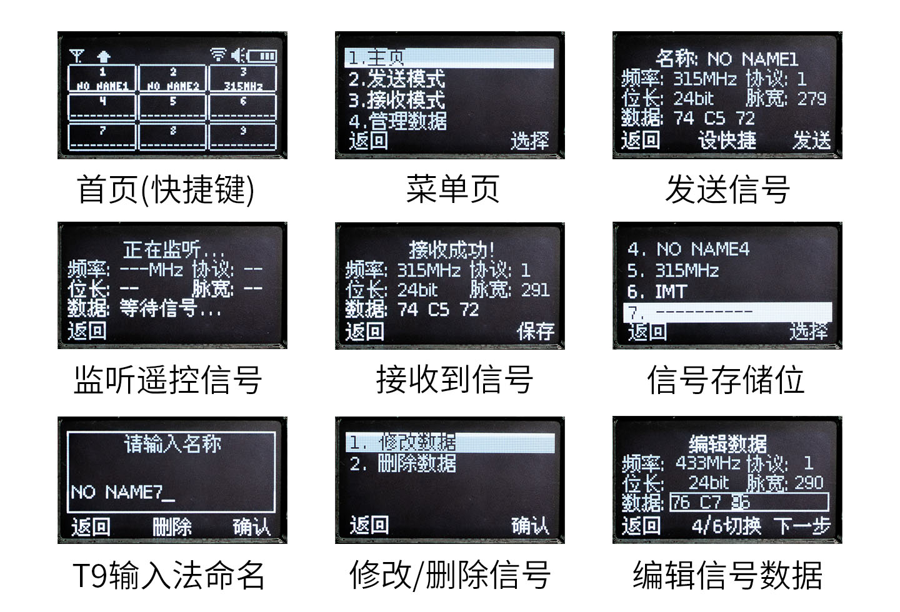
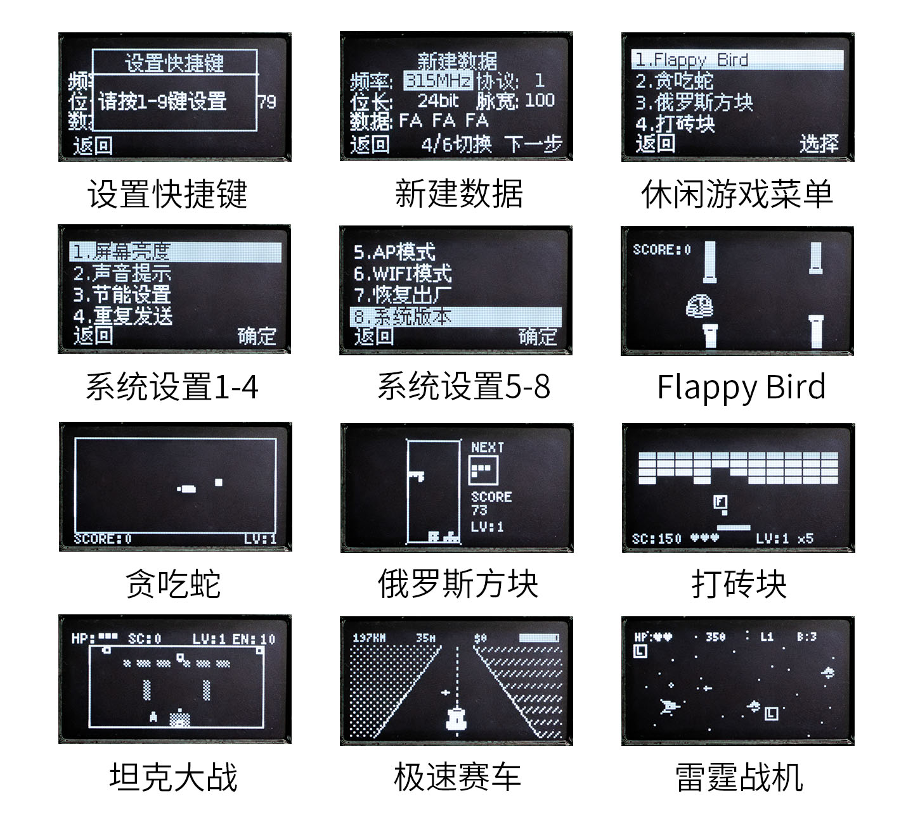
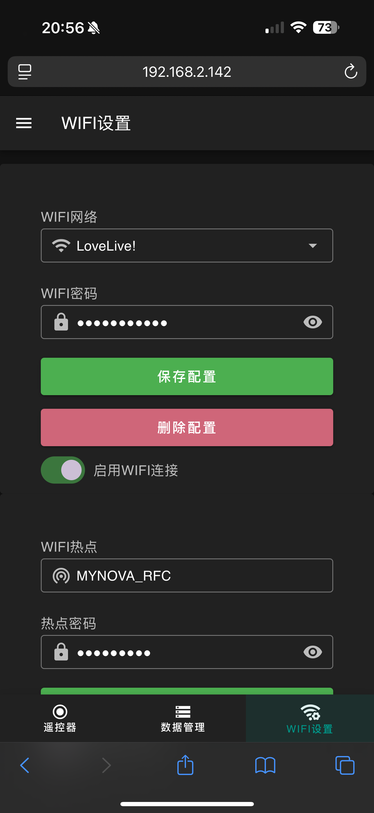

# MYNOVA RFC - 射频遥控大师

[切换简体中文](README_CHS.md) | [English](README.md)

**MYNOVA RFC** (Radio Frequency Control) 是一款开源的手持硬件项目，专为分析、复制和发射射频 (RF) 信号而设计。它基于 ESP32 微控制器，结合了流畅的 OLED 用户界面、强大的射频功能、Web 管理界面以及 Home Assistant 集成。


## ✨ 功能特性

### 📡 射频 (RF) 能力
- **信号接收与分析：** 捕获并分析射频信号（取决于模块，通常为 315MHz/433MHz）。
- **信号克隆：** 将捕获的信号保存到本地存储。
- **信号发射：** 重放保存的信号以控制设备。
- **数据库管理：** 直接在设备上管理射频代码库。

### 🎮 用户界面
- **OLED 显示：** 基于 U8g2 的流畅图形界面。
- **交互菜单：** 通过物理按键轻松导航。
- **内置游戏：** 包含贪吃蛇、俄罗斯方块、打砖块、坦克大战等经典游戏，供休闲娱乐。

### 🌐 连接与物联网 (IoT)
- **WiFi 支持：** 支持连接家庭网络 (Station) 或作为热点 (AP) 运行。
- **Web 管理界面：** 功能全面的 Web 管理仪表盘。
  - 管理 WiFi 设置。
  - 查看和编辑已保存的射频数据。
  - 配置 MQTT/Home Assistant 设置。
- **Home Assistant 集成：** 通过 MQTT 无缝集成到 Home Assistant，从智能家居中心控制您的 RF 设备。

### 🔋 电源管理
- **电池监控：** 实时显示电池电压和百分比。
- **省电模式：** 支持睡眠模式和屏幕亮度调节。

## 🛠️ 硬件展示


## 结构设计


## 💻 软件与固件

### 开发环境
- **IDE:** [Arduino IDE 2.3.6](https://www.arduino.cc/en/software)
- **开发板包 (Board Package):** ESP32 by Espressif Systems **v3.1.1** (请务必使用此版本，否则可能导致兼容性问题)。

### 依赖库
固件依赖以下 Arduino 库，请在编译前安装：
- **U8g2** (v2.34.22) - OLED 图形库。
- **ArrayList** (v1.0.0) - 动态数组实现。
- **ESP Async WebServer** (v3.9.2) - 异步 HTTP 服务器。
- **AsyncTCP** (v3.4.9) - 异步 TCP 库。
- **ArduinoJson** (v7.0.3) - JSON 解析与序列化。
- **PubSubClient** (v2.8) - MQTT 客户端库。

### 📂 目录结构

```text
MYNOVA_RFC/
├── MYNOVA_RFC/             # 固件源代码
│   ├── src/
│   │   ├── GUI/            # 自研 UI 引擎
│   │   │   ├── Animation/  # 动画系统 (页面切换、动效)
│   │   │   ├── Widget/     # UI 组件库 (按钮、菜单、进度条等)
│   │   │   ├── UIEngine    # 核心 UI 管理器 (页面栈、渲染循环)
│   │   │   └── UIPage      # 页面基类
│   │   ├── Pages/          # 业务页面实现 (主页、游戏、设置)
│   │   ├── Lib/            # 硬件驱动库 (RCSwitch 等)
│   │   └── ...             # 系统管理器 (WiFi, MQTT, 电池管理)
│   └── MYNOVA_RFC.ino      # Arduino 主入口文件
├── RFCWeb/                 # Web 管理界面 (Vue.js 3 + Vite)
├── 3DModel/                # 外壳3D模型
└── PCB/                    # PCB设计文件
```

## 🎨 自定义 UI 引擎架构

MYNOVA RFC 搭载了一套专为 ESP32 和 OLED 优化的自研高性能 GUI 引擎。

- **页面管理 (栈式架构):** 实现了基于栈（Stack）的页面管理系统，支持流畅的层级导航（入栈/出栈），提供类似手机 App 的操作体验。
- **组件化设计 (Widgets):** 界面由可复用的 `UIWidget` 组件（按钮、菜单、进度条等）构建，模块化程度高，易于扩展新功能。
- **延迟删除机制 (Safe Lifecycle):** 独创的 `markForDeletion` 内存管理机制，确保在渲染帧结束后才安全释放资源，彻底解决了嵌入式 GUI 开发中常见的野指针崩溃问题。
- **动画系统:** 支持平滑的非阻塞式页面切换动画（滑动、缩放）和组件动画，与渲染循环解耦，确保极致流畅的视觉体验。

## 显示屏 UI



## Web控制 UI





## Home Assistant


## 🚀 快速开始

### 1.从源码烧录固件 (ESP32)
1.  在 Arduino IDE 中打开 `MYNOVA_RFC/MYNOVA_RFC.ino`。
2.  通过库管理器安装上述列出的所有依赖库。
3.  开发板选择：**ESP32 Dev Module**。
4.  根据需要设置 Core Debug Level（调试等级）。
5.  编译并上传到您的设备。

### 2. Web 界面 
如果从源码编译固件烧录是不带Web界面的，需要单独进行编译并烧录：

1.  进入 `RFCWeb` 目录。
2.  安装依赖：
    ```bash
    npm install
    ```
3.  运行开发服务器：
    ```bash
    npm run dev
    ```
4.  构建生产版本：
    ```bash
    npm run build
    ```
5.  将 `dist` 文件夹中的内容上传到 ESP32 的文件系统 (LittleFS) 中。

备注：可以使用我的开源工具 [ESP32-LittleFS-Flash](https://github.com/Tomosawa/ESP32-LittleFS-Flash) 来方便地将 `dist` 文件夹中的内容上传到 ESP32 的文件系统 (LittleFS) 中。
上传的地址偏移为 `0x610000`，大小为 `0x1D0000`。这个在`partitions.csv`中有定义。

### 3. 从编译好二进制文件烧录固件

1. **下载固件**：在 [Release](https://github.com/tomosawa/MYNOVA-RFC/releases) 页面下载最新的 `.bin` 文件。
2. **烧录方式**：
   * **Flash Download Tool**：请在ESP官网下载这个工具运行，然后选择 `.bin` 文件，设置烧录地址为 `0x0000`。
     * *注：固件已包含所有分区以及WebUI界面，无需额外配置，烧录完即可使用。*
   * **命令行**：
```bash
esptool.py --chip esp32s3 --port <port> --baud <baud_rate> write_flash 0x0000 firmware.bin
```

## 📄 许可证

本项目采用 **GNU General Public License v3.0** 许可证。详情请参阅 [LICENSE](LICENSE) 文件。

## 感谢
本项目中有用到以下代码，感谢原作者。
[rc-switch](https://github.com/sui77/rc-switch)